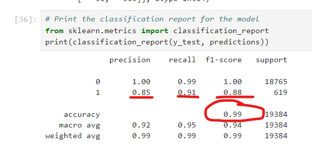
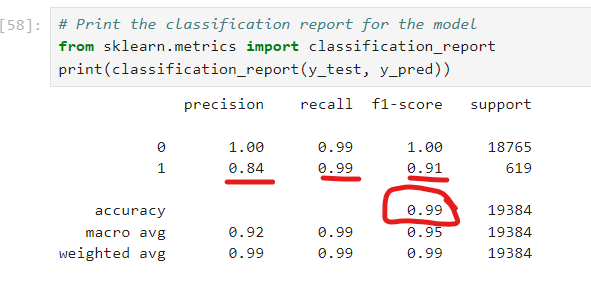

### Credit-Risk-Classification
Here I used a logistic regression model to compare two versions of the dataset. I used various techniques to train and evaluate models with imbalanced classes. I used a dataset of historical lending activity from a peer-to-peer lending services company to build a model that can identify the creditworthiness of borrowers..

## Overview of the Analysis

*The purpose of this analysis is to identify the credit-worthiness of borrowers.

---

* The data provided divulges borrowers financial information and the data related to thier loans. It shows: 
    * Their loan size	
    *Their interest rate	
    *The borrower's income	
    *The borrowers debt to income ratio
    * The number of accounts the borrower has	
    *The number of derogatory marks in their credit history
    *Their total debt	
    *Their loan status
* The borrowers were split up into two groups. Class (or Group) 0 (healthy loan) and Class (or group) 1 (high risk loans).The goal was to predict both the 0 (healthy loan) and 1 (high-risk loan) labels.
---

* The analysis focused on predicting the loan_status variable. This variable represents the status of a loan, with two possible classes: 0 (indicating a certain outcome) and 1 (indicating another outcome). 

* The stages of the machine learning process I went through were as followed:
*Data Preprocessing:
    *Imported necessary libraries and the dataset.
*Data Splitting:
    *Split the dataset into training and testing sets to evaluate the model's performance.
*Model Selection and Training:
    *Choose the Logistic Regression algorithm as the initial model and used the LogisticRegression class from scikit-learn for binary classification. 
    *Instantiated the model and set the random_state parameter to 1.
    *Model, fit, predict
*Model Evaluation:
    *I made predictions using the trained model from the testing data.
---

## Results

Using bulleted lists, describe the balanced accuracy scores and the precision and recall scores of all machine learning models.

* Machine Learning Model 1:
    * For model 1 the accuracy was 99% 
    *The percision for Class 0 and Class 1 were 1.00 and 0.85 respectively.
    *The Recall scores for Class 0 and Class 1 were 0.99 and 0.91  respectively.

* Machine Learning Model 2:
    * For model 1 the accuracy was 99% 
    *The percision for Class 0 and Class 1 were 1.00 and 0.84 respectively.
    *The Recall scores for Class 0 and Class 1 were 0.99 and 0.99  respectively.

## Summary

Both of the models of high accuracy. The only "significant" difference is the percision in model 1 is higher in Class 1 than in Model 2 and the Recall score is higher in model 2 Class 1 than it is in model 1. I don't have a reccomendation for which model I think would be better to use. The choice of model could depend on the problem you are trying to solve and the trade-offs you are willing to make between precision and recall. 
